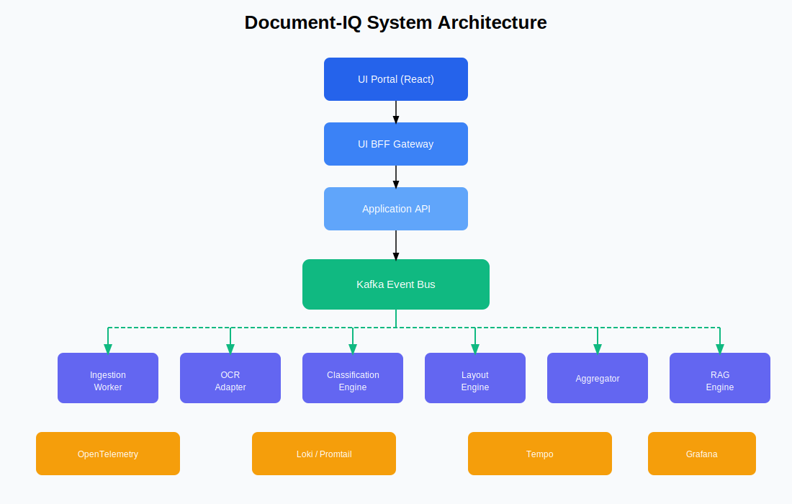
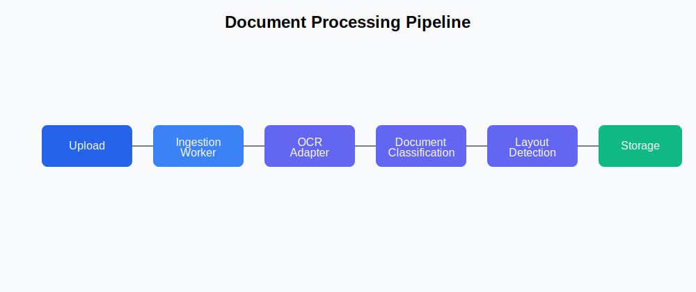
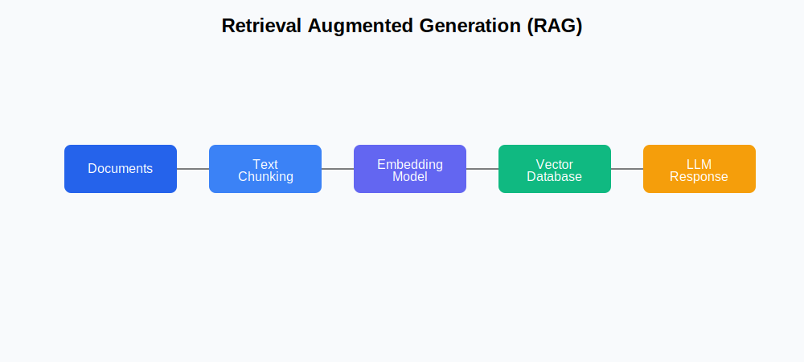
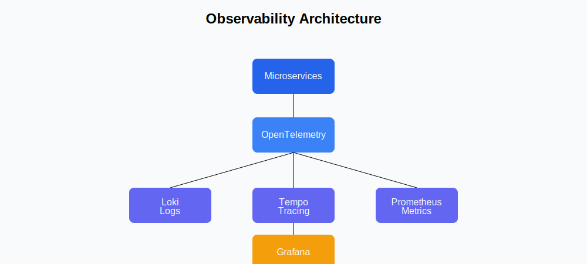

  

Document-IQ is a **cloud-native document intelligence platform** designed to process, analyze, and query enterprise documents using  **AI, distributed systems, and event-driven microservices** .

The platform provides a complete pipeline for:

<pre class="overflow-visible! px-0!" data-start="595" data-end="696">

Document Upload → OCR → Classification → Layout Understanding → Knowledge Retrieval → AI Chat

</pre>

It demonstrates  **real-world AI system design** , including:

* Event-driven microservices
* ML pipelines and model registry
* Retrieval Augmented Generation (RAG)
* Multi-tenant SaaS architecture
* Observability and distributed tracing

---

# System Architecture

Document-IQ is designed as a **distributed microservices architecture** connected through  **Kafka event streams** .

Key design principles:

* **Loose coupling via Kafka**
* **Independent microservices**
* **Async document processing**
* **Horizontal scalability**

---

# Document Processing Pipeline

The system processes documents through multiple stages.

---

# Key Features

## Multi-Tenant SaaS Platform

* Organization-based workspaces
* Role-based access control (Admin / Member)
* Secure document isolation

---

## Event-Driven Architecture

The system uses **Kafka** for asynchronous processing.

Benefits:

* High throughput
* Fault isolation
* Service decoupling
* Scalability

---

## AI-Powered Document Understanding

Document-IQ integrates  **machine learning and deep learning models** .

### Document Classification

Classifies document types using engineered text features.

Example features:

* token count
* line count
* average line length
* table detection

These features form a  **feature contract used across training and inference** .

---

### Layout Detection

The layout engine detects document structure such as:

* Header
* Text
* Table
* Footer

This enables  **layout-aware document understanding** .

---

### AI Chat over Documents (RAG)

Users can query documents using natural language.

Example questions:

* *"Summarize this document"*
* *"What dates are mentioned?"*
* *"List key action items"*

Pipeline:

---

# Observability Stack

Document-IQ includes  **production-grade observability** .

This enables:

* distributed tracing
* centralized logging
* system debugging
* performance monitoring

---

# Project Structure

<pre class="overflow-visible! px-0!" data-start="5441" data-end="6245">

. ├── document-iq/ │ │   ├── document-iq-core │   │   Shared schemas, configs, ML utilities │ │   ├── document-iq-ml-pipeline │   │   Classical ML training pipelines │ │   ├── document-iq-dl-pipeline │   │   Deep learning layout training │ │   └── document-iq-platform │       ├── components │       │   ├── account-component │       │   ├── application-component │       │   ├── ingestion-worker │       │   ├── ocr-adapter │       │   ├── classification-engine │       │   ├── layout-engine │       │   ├── rag-engine │       │   └── aggregator │       │ │       ├── gateways │       │   └── ui-bff │       │ │       ├── shared │       │   └── platform shared code │       │ │       ├── ui-portal │       │   React frontend │       │ │       └── docker-compose.yml │ └── infra     └── terraform

</pre>

This separation allows:

* ML pipelines to evolve independently
* platform services to scale independently
* infrastructure to be managed separately. Document-iq folder structure

---

# Technology Stack

## Backend

* Python
* FastAPI
* Kafka
* PostgreSQL
* Redis

## AI / ML

* Scikit-learn
* PyTorch
* MLflow
* Feature contracts

## Infrastructure

* Docker
* Docker Compose
* Terraform

## Observability

* OpenTelemetry
* Loki
* Promtail
* Tempo
* Grafana

## Frontend

* React
* React Router
* Context API

---

# ML Infrastructure

The platform includes  **ML lifecycle management** .

Capabilities:

* experiment tracking
* model versioning
* production model registry

Example model loading:

<pre class="overflow-visible! px-0!" data-start="6951" data-end="7106">

defload_production_model(model_name: str): model_uri=f"models:/{model_name}/Production" returnmlflow.pyfunc.load_model(model_uri)

</pre>

This ensures  **consistent model deployment across services** . document-iq-core

---

# Running the Platform

## Clone Repository

<pre class="overflow-visible! px-0!" data-start="7259" data-end="7341">

git clone https://github.com/PranavTupe2000/document-iq cd document-iq

</pre>

---

## Start Platform

<pre class="overflow-visible! px-0!" data-start="7367" data-end="7436">

cd document-iq/document-iq-platform docker compose up --build

</pre>

This starts:

* Kafka
* Microservices
* Database
* Observability stack
* UI Portal

---

# Example Workflow

1️⃣ Create organization

2️⃣ Login to portal

3️⃣ Upload document

Processing pipeline:

<pre class="overflow-visible! px-0!" data-start="7640" data-end="7757">

Upload  ↓ OCR  ↓ Classification  ↓ Layout Detection  ↓ Aggregation  ↓ Stored in platform  ↓ Query via AI Chat

</pre>

---

# Why This Project Is Portfolio-Grade

Document-IQ demonstrates **real-world production engineering skills** including:

* Distributed systems design
* Event-driven architecture
* Microservices orchestration
* ML lifecycle management
* AI system deployment
* Observability and monitoring
* Multi-tenant SaaS systems

This type of system is similar to platforms built by:

* AWS Textract pipelines
* Google Document AI
* enterprise knowledge platforms

---

# Future Improvements

Planned enhancements:

* Transformer-based document classification
* LayoutLM for document understanding
* Vector database integration
* Kubernetes deployment
* autoscaling pipelines
* streaming ingestion

---

# Author

**Pranav Tupe**

Software Engineer | AI Systems | Distributed Systems

GitHub

[https://github.com/PranavTupe2000]()

LinkedIn

[https://www.linkedin.com/in/tupepranav/]()
